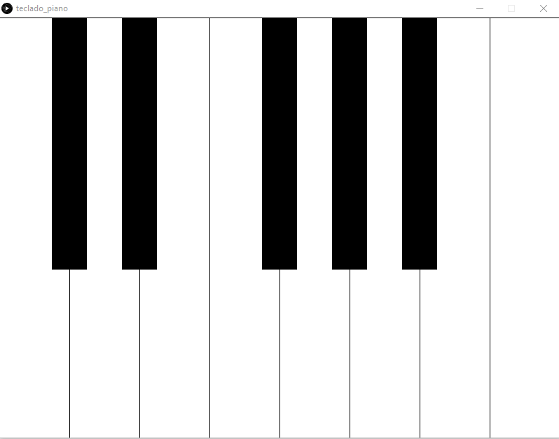
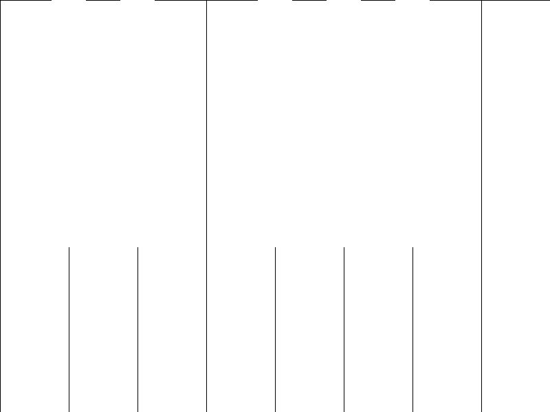

<!-- TABLE OF CONTENTS -->
<details open="open">
  <summary>Tabla de contenidos</summary>
  <ol>
    <li>
      <a href="#Autor">Autor</a>
    </li>
    <li>
      <a href="#Trabajo realizado">Trabajo realizado</a>
    </li>
    <li><a href="#decisiones-adoptadas">Decisiones adoptadas</a></li>
    <li><a href="#referencias">Referencias</a></li>
    <li><a href="#herramientas">Herramientas</a></li>
    <li><a href="#resultado">Resultado</a></li>
  </ol>
</details>


## Autor

El autor de este proyecto es el estudiante Alejandro Daniel Herrera Cárdenes para la asignatura Creando Interfaces de Usuario (CIU) para el profesor Modesto Fernando Castrillón Santana. 


## Trabajo realizado

El trabajo se basa en hacer familiarizarse con la libreria Sound de Processing. En este caso realicé una simulación de un piano.

## Decisiones adoptadas

Las mayores decisiones tomadas y las que mas pruebas requirieron fue la clase encargada de crear el sonido de las notas y que no se superpusieran entre ellas.


* Clase MusicBox.
  ```
  public class MusicBox {
  Synthesizer synthesizer;
  MidiChannel[] channels;
  boolean noSound = false;

  public void initialize() {
    try {
      if (!noSound) {
        synthesizer = MidiSystem.getSynthesizer();
        synthesizer.open();

        channels = synthesizer.getChannels();

        Instrument[] instr = synthesizer.getDefaultSoundbank()
          .getInstruments();
        synthesizer.loadInstrument(instr[0]);
        System.out.println(channels.length);
      }
    }
    catch (Exception ex) {
      System.out.println("Could not load the MIDI synthesizer.");
    }
  }

  public void cleanUp() {
    if (synthesizer != null)
      synthesizer.close();
  }

  public void playNote(final int note, final int milliseconds) {
    System.out.println("");

    Thread t = new Thread() {
      public void run() {
        try {
          if (!noSound && channels != null && channels.length > 0) {
            channels[0].noteOn(note, 120);
            sleep(milliseconds);
            channels[0].noteOff(note);
          }
        } 
        catch (Exception ex) {
          System.out.println("ERROR: " + ex);
        }
      }
    };
    t.start();
  }

  public void playChord(int note1, int note2, int note3, int milliseconds) {
    playChord(new int[] {note1, note2, note3}, milliseconds);
  }

  public void playChord(final int[] notes, final int milliseconds) {
    System.out.println("");

    Thread t = new Thread() {
      public void run() {
        try {
          if (!noSound && channels != null && channels.length > 0) {
            int channel = 0;
              for (int n : notes) {
                channels[channel++].noteOn(n, 120);
              }
              sleep(milliseconds);
              for (channel = 0; channel < notes.length; channel++) {
                channels[channel].noteOff(notes[channel]);
              }
            }
          }
          catch (Exception ex) {
            System.out.println("ERROR:" + ex);
          }
        }
      };
      t.start();
    }

    public void playScale(int note1, int note2, int note3, int note4, int note5, 
      int note6, int note7, int note8, int milliseconds) {
      playScale(new int[] {note1, note2, note3, note4, note5, note6, note7, note8}, milliseconds);
    }

    public void playScale(final int[] notes, final int milliseconds) {
      Thread t = new Thread() {
        public void run() {
          try {
            if (!noSound && channels != null && channels.length > 0) {
              for (int n : notes) {
                channels[0].noteOn(n, 120);
                sleep(milliseconds);
                channels[0].noteOff(n);
              }
            }
          }
          catch (Exception ex) {
            System.out.println("ERROR:" + ex);
          }
        }
      };
      t.start();
    }

    private void sleep(int length) {
      try {
        Thread.sleep(length);
      }
      catch (Exception ex) {
      }
    }
  }

 <p align="center"></br>Pantalla final</p>
 


## Referencias

Para ayudarme en la realización de esta aplicación usé la API que te proporciona [Processing](https://www.processing.org/).

* [Documentación de clase](https://ncvt-aep.ulpgc.es/cv/ulpgctp21/pluginfile.php/412240/mod_resource/content/40/CIU_Pr_cticas.pdf).

* [Processing](https://www.processing.org/)


## Resultado

Añado un GIF con el resultado de la aplicación final con el piano.

  * Resultado
  <p align="center"></br>Gif resultado final</p>

